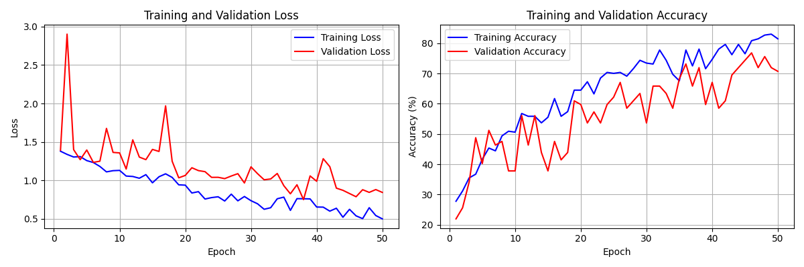

# Attention-Based CNN for Image Classification

This project implements an attention-based Convolutional Neural Network (CNN) using Convolutional Block Attention Module (CBAM) for image classification. The model is designed to classify images organized in subdirectories where each subdirectory name represents a class label.

## Features

- **CBAM Attention Mechanism**: Combines channel attention and spatial attention for improved feature learning
- **Flexible Architecture**: Customizable CNN with attention blocks at multiple levels
- **Data Augmentation**: Built-in data augmentation for better generalization
- **Training Pipeline**: Complete training script with validation, checkpointing, and learning rate scheduling
- **Evaluation Tools**: Comprehensive evaluation with confusion matrix and classification reports
- **Single Image Inference**: Predict classes for individual images

## Project Structure

```
yul_dog_breed/
├── pictures/              # Image dataset (subdirectories = class labels)
│   ├── class1/
│   ├── class2/
│   └── ...
├── model.py              # Attention-based CNN model definition
├── data_loader.py        # Data loading and preprocessing utilities
├── train.py                      # Training script
├── evaluate.py                   # Evaluation and inference script
├── optimize_hyperparameters.py   # Optuna hyperparameter optimization
├── requirements.txt              # Python dependencies
└── README.md                     # This file
```

## Installation

1. Install the required dependencies:

```bash
pip install -r requirements.txt
```

## Dataset Organization

Organize your images in the `pictures` directory as follows:

```
pictures/
├── class_name_1/
│   ├── image1.jpg
│   ├── image2.jpg
│   └── ...
├── class_name_2/
│   ├── image1.jpg
│   └── ...
└── ...
```

Each subdirectory name will be used as the class label.

## Usage

### Training

Train the model with default settings:

```bash
python train.py --data_dir pictures
```

Train with custom parameters:

```bash
python train.py \
    --data_dir pictures \
    --batch_size 32 \
    --epochs 50 \
    --lr 0.001 \
    --image_size 224 \
    --train_split 0.8 \
    --save_dir checkpoints
```

**Training Arguments:**
- `--data_dir`: Path to directory containing labeled subdirectories (default: `pictures`)
- `--batch_size`: Batch size for training (default: `32`)
- `--epochs`: Number of training epochs (default: `50`)
- `--lr`: Learning rate (default: `0.001`)
- `--image_size`: Input image size (default: `224`)
- `--train_split`: Fraction of data for training (default: `0.8`)
- `--save_dir`: Directory to save checkpoints (default: `checkpoints`)
- `--resume`: Path to checkpoint to resume training from (optional)

### Hyperparameter Optimization

Use Optuna to automatically find the best hyperparameters:

```bash
python optimize_hyperparameters.py --data_dir pictures --n_trials 50 --epochs 30
```

Optimize with custom settings:

```bash
python optimize_hyperparameters.py \
    --data_dir pictures \
    --n_trials 100 \
    --epochs 30 \
    --pruner median \
    --study_name my_optimization
```

**Optimization Arguments:**
- `--data_dir`: Path to directory containing labeled subdirectories (default: `pictures`)
- `--n_trials`: Number of optimization trials to run (default: `50`)
- `--epochs`: Number of training epochs per trial (default: `30`)
- `--train_split`: Fraction of data for training (default: `0.8`)
- `--study_name`: Name of the Optuna study (default: `dog_breed_optimization`)
- `--storage`: Storage URL for Optuna study (e.g., `sqlite:///optuna.db`) (optional)
- `--load_if_exists`: Load existing study if it exists (flag)
- `--direction`: Optimization direction - `maximize` or `minimize` (default: `maximize`)
- `--pruner`: Pruner type - `median`, `nop`, or `successive_halving` (default: `median`)
- `--n_jobs`: Number of parallel jobs (default: `1`)

**Optimized Hyperparameters:**
- Learning rate (log scale: 1e-5 to 1e-2)
- Batch size (16, 32, 64, 128)
- Weight decay (log scale: 1e-6 to 1e-3)
- Image size (224, 256, 288)
- Optimizer type (Adam, AdamW, SGD)
- SGD momentum (if using SGD)
- Learning rate scheduler factor and patience

**Optimization Outputs:**
- **Best Hyperparameters**: `optuna_checkpoints/best_hyperparameters.json`
- **Study Object**: `optuna_checkpoints/{study_name}.pkl`
- **Visualization Plots**: `optuna_checkpoints/plots/` (requires plotly and kaleido)

### Evaluation

Evaluate the model on the validation set:

```bash
python evaluate.py --checkpoint checkpoints/best_model.pth --data_dir pictures
```

Predict a single image:

```bash
python evaluate.py --checkpoint checkpoints/best_model.pth --image_path path/to/image.jpg
```

**Evaluation Arguments:**
- `--checkpoint`: Path to model checkpoint (required)
- `--data_dir`: Path to directory containing labeled subdirectories (default: `pictures`)
- `--image_path`: Path to single image for prediction (optional)
- `--image_size`: Input image size (default: `224`)
- `--batch_size`: Batch size for evaluation (default: `32`)
- `--output_dir`: Directory to save evaluation results (default: `results`)

## Model Architecture

The model uses a CBAM (Convolutional Block Attention Module) architecture:

1. **Channel Attention**: Focuses on "what" is important in the feature maps
2. **Spatial Attention**: Focuses on "where" important information is located
3. **Multi-level Attention**: Attention blocks at different CNN layers for hierarchical feature learning

The architecture consists of:
- Initial convolution and pooling layers
- Four convolutional blocks with CBAM attention modules
- Global average pooling
- Fully connected classifier with dropout

## Training Outputs

The training script generates:
- **Checkpoints**: Saved after each epoch in the `checkpoints/` directory
- **Best Model**: `checkpoints/best_model.pth` (model with highest validation accuracy)
- **Final Model**: `checkpoints/final_model.pth` (model from last epoch)
- **Training History**: `checkpoints/training_history.png` (loss and accuracy plots)

### Example Training Results

Training history for 4 classes of dogs with 100 images per class:



## Evaluation Outputs

The evaluation script generates:
- **Evaluation Results**: `results/evaluation_results.json` (accuracy metrics)
- **Confusion Matrix**: `results/confusion_matrix.png` (visual confusion matrix)

## Tips for Better Performance

1. **Data Quality**: Ensure you have balanced classes and sufficient images per class (recommended: 100+ images per class)
2. **Data Augmentation**: The training script includes data augmentation by default. Adjust in `data_loader.py` if needed.
3. **Hyperparameter Optimization**: Use `optimize_hyperparameters.py` to automatically find the best hyperparameters for your dataset
4. **Learning Rate**: Start with 0.001 and use the learning rate scheduler (automatically reduces LR on plateau)
5. **Batch Size**: Adjust based on your GPU memory (larger batch sizes may improve training stability)
6. **Image Size**: 224x224 is standard, but you can experiment with other sizes
7. **Training Duration**: Monitor validation accuracy and stop early if overfitting occurs

## System Specifications

**Tested on:**
- **OS**: Windows 11
- **CPU**: 4 physical cores, 8 logical cores
- **RAM**: 7.73 GB
- **GPU**: None (CPU-only training)
- **Python**: 3.13.5
- **PyTorch**: 2.10.0+cpu

Training time: 6 days, 9:57:56.551175
> Note: Training performance will vary based on hardware. GPU acceleration is recommended for faster training.

## Requirements

- Python 3.7+
- PyTorch 2.0+
- CUDA (optional, for GPU acceleration)
- See `requirements.txt` for full list of dependencies

## License

This project is provided as-is for educational and research purposes.
